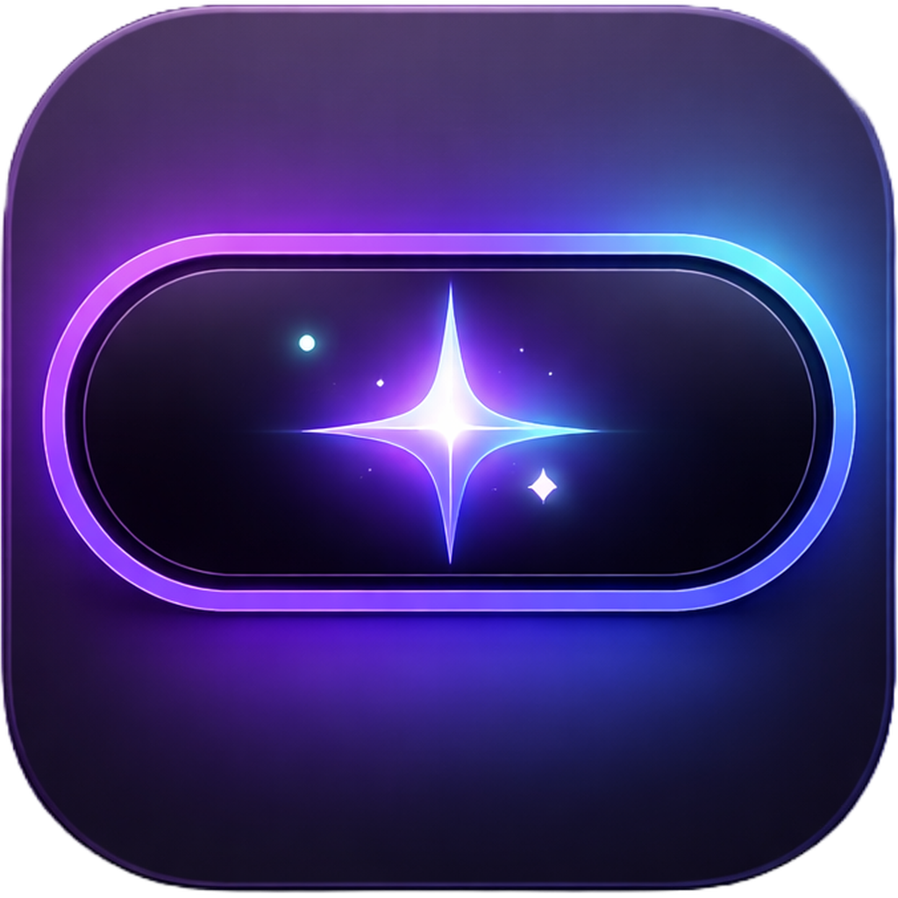
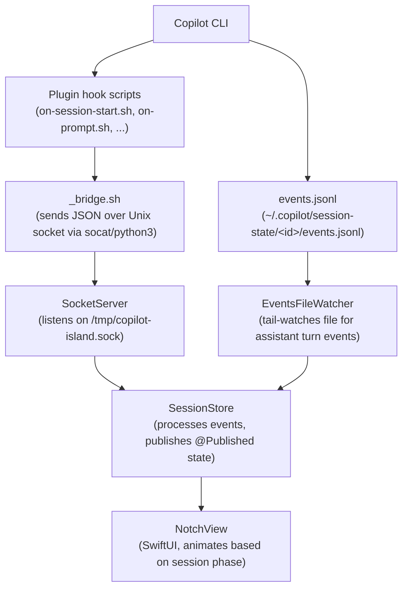
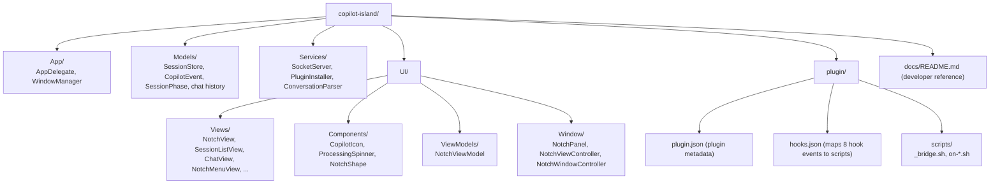

<div align="center">
  
  <div><b>Copilot Island</b></div>
</div>

<br>
<br>

> **⚠️ Note**: This project is under active development. Features and APIs may change. Install at your own responsibility.

A macOS Dynamic Island–style notch UI for **GitHub Copilot CLI** — see what Copilot is doing in real-time without switching windows.

Inspired by [claude-island](https://github.com/farouqaldori/claude-island)

## What it does

Copilot Island lives in your Mac's notch. While Copilot CLI is thinking, running tools, or waiting for your input, the notch expands to show live activity indicators. Click it to open a full session panel with chat history, tool calls, and recent sessions.

- **Live activity**: notch widens and animates when Copilot is processing or running a tool
- **New message dot**: a small white dot on the closed notch signals when the assistant has finished a reply
- **Session panel**: click to expand and see the active session, prompt, and tool output
- **Chat history**: browse past sessions with full message and tool-call logs
- **Zero dock presence**: runs as a macOS accessory app; no dock icon, no menu bar icon

## Requirements

- macOS with a physical notch (MacBook Pro 14"/16", MacBook Air M2+)
- [GitHub Copilot CLI](https://docs.github.com/en/copilot/github-copilot-in-the-cli) installed (`copilot` on your PATH)
- `socat` or `python3` (for socket communication in hook scripts)
- `jq` (for JSON processing in hook scripts)

## Installation

### 1. Build the app

```bash
just build
```

Or with `xcodebuild`:

```bash
xcodebuild -project copilot-island.xcodeproj \
  -scheme copilot-island \
  -configuration Release \
  -derivedDataPath build/DerivedData \
  -destination 'platform=macOS' \
  CONFIGURATION_BUILD_DIR=build/Release \
  clean build
```

Build output: `build/Release/Copilot Island.app`

### 2. Install the Copilot plugin

Launch the app, then click the notch and open the menu (≡) → **Install Plugin**. The app will run:

```bash
copilot plugin install --path <plugin-directory>
```

Alternatively, install manually:

```bash
copilot plugin install --path /path/to/copilot-island/plugin
```

### 3. Use Copilot CLI normally

Start any `copilot` session. The notch will appear automatically when activity begins.

## How it works



The Copilot CLI plugin fires hook scripts for 8 lifecycle events. Each script calls `_bridge.sh`, which forwards the event as JSON to the Unix socket the app is listening on. `SessionStore` decodes the events and drives the UI state machine.

Some events — specifically `assistant.turn_start` and `assistant.turn_end` — have no plugin hook. Instead, `EventsFileWatcher` tail-watches the session's `events.jsonl` file directly using a kqueue dispatch source, calling back into `SessionStore` when the assistant starts or finishes a turn.

## Project structure



See [`docs/README.md`](docs/README.md) for a detailed developer reference with per-file descriptions.