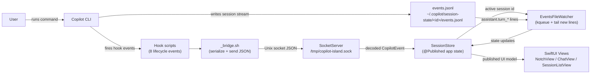
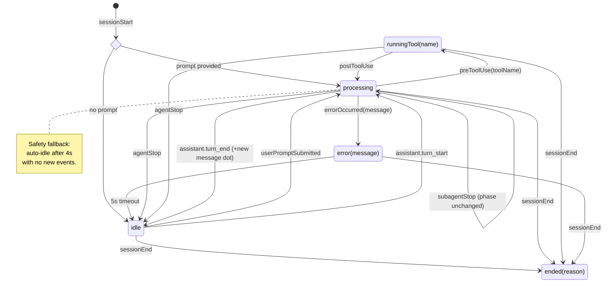
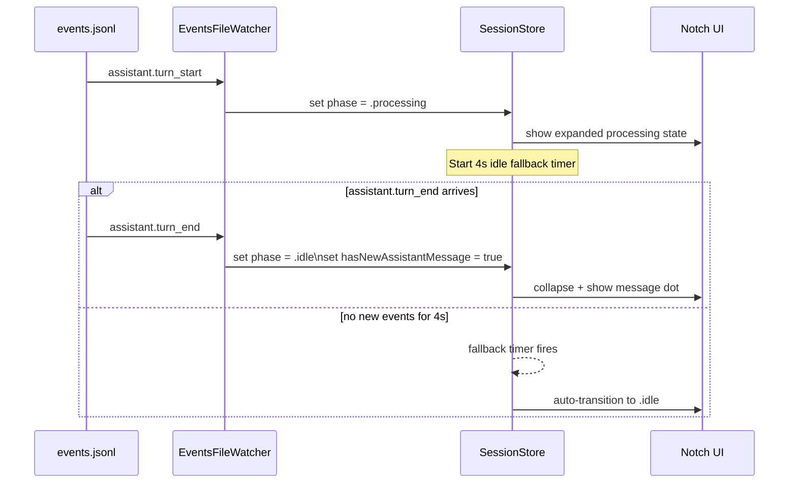

# Copilot Island: Developer Reference

For install instructions see the [root README](../README.md).

---

## Architecture Overview

Copilot Island is a macOS accessory app that displays GitHub Copilot CLI activity in the Dynamic Island/notch area. The app communicates with Copilot CLI through a plugin system and direct file monitoring.

### High-Level Data Flow



---

## Communication Protocols

### Plugin Hook → App Communication (Unix Socket)

The Copilot CLI plugin fires 8 hook events. Each hook script sends JSON to the app via a Unix domain socket.

**Socket Path**: `/tmp/copilot-island.sock`

**JSON Event Format**:
```json
{
  "eventType": "sessionStart",
  "sessionId": "abc123",
  "timestamp": "2024-01-15T10:30:00Z",
  "payload": {
    "cwd": "/Users/user/project",
    "prompt": "explain this code"
  }
}
```

**Hook Events**:
| Event | Description | Payload |
|-------|-------------|---------|
| `sessionStart` | New Copilot session begins | `cwd`, optional `prompt` |
| `sessionEnd` | Session ends | `reason` |
| `userPromptSubmitted` | User submits a prompt | `prompt` |
| `preToolUse` | Copilot is about to run a tool | `toolName`, `toolInput` |
| `postToolUse` | Tool execution completed | `toolName`, `toolResult` |
| `errorOccurred` | An error occurred | `errorMessage` |
| `agentStop` | Main agent stopped | - |
| `subagentStop` | Sub-agent stopped | - |

### Bridge Script (`_bridge.sh`)

The bridge script converts hook events to socket messages:

```bash
# Primary: use socat
echo '{"eventType":"'$EVENT_TYPE'",...}' | socat - UNIX-CONNECT:/tmp/copilot-island.sock

# Fallback: use python3
python3 -c "import socket; s=socket.socket(socket.AF_UNIX); s.connect('/tmp/copilot-island.sock'); s.send(b'{\"eventType\":\"$EVENT_TYPE\",...}')"
```

### File Watcher (events.jsonl)

Some events (`assistant.turn_start`, `assistant.turn_end`) have no plugin hook. These are read directly from the session's `events.jsonl` file.

**File Path**: `~/.copilot/session-state/<session-id>/events.jsonl`

**Line Format** (JSONL):
```jsonl
{"type":"user.message","content":"explain this function","timestamp":...}
{"type":"assistant.thinking","content":"Let me analyze...","timestamp":...}
{"type":"assistant.turn_start","timestamp":...}
{"type":"tool.execution_start","tool":"bash","input":"ls -la","timestamp":...}
{"type":"tool.execution_complete","tool":"bash","result":"total 0\ndrwxr-xr-x 5...","timestamp":...}
{"type":"assistant.turn_end","timestamp":...}
{"type":"assistant.message","content":"This function does...","timestamp":...}
```

**Watcher Implementation**:
- Uses `DispatchSource` with `DISPATCH_SOURCE_TYPE_VNODE` for file monitoring
- Seeks to EOF on start to skip historical events
- On file change, reads only new lines
- Parses each line for `assistant.turn_start` or `assistant.turn_end`

---

## State Machine

### Session Phase Transitions



### Assistant Turn Events (via events.jsonl)



---

## Notch UI Behavior

### Visibility States

| State | Notch Appearance | Duration |
|-------|------------------|----------|
| `processing` | Expanded with spinner | Until event received |
| `runningTool(name)` | Expanded with tool name | Until `postToolUse` |
| `error(message)` | Expanded with error indicator | 5 seconds |
| `idle` | Faded/closed | 3 seconds then fade |
| `ended(reason)` | Faded | 3 seconds then fade |

### Interaction Flow

1. **Copilot activity begins** → Notch pops up (slide animation)
2. **User clicks notch** → Expands to 380×280pt panel
3. **Click outside panel** → Collapses back to notch
4. **New assistant message** → White dot appears on closed notch
5. **Click dot/notch** → Opens panel, dot clears
6. **Session ends** → Notch fades after 3 seconds

---

## Setup Detection

On launch, the app verifies the environment:

```swift
// Check 1: Is Copilot CLI installed?
let copilotPath = shell("which copilot")
// Runs: /opt/homebrew/bin/copilot (or similar)

// Check 2: Is plugin installed?
let pluginList = shell("copilot plugin list")
// Output: "copilot-island"

// Both checks run on background thread
Task.detached {
    let copilot = await checkCopilotInstalled()
    let plugin = await checkPluginInstalled()
}
```

**Cached in**: `SessionStore.copilotInstalled`, `SessionStore.pluginInstalled`

---

## File Reference

### Entry Point & App Lifecycle

| File | Purpose |
|------|---------|
| `main.swift` | App entry point, sets up NSApplication as accessory app (no dock icon) |
| `App/AppDelegate.swift` | Lifecycle delegate, ensures single instance, creates window, starts socket server |
| `App/WindowManager.swift` | Creates and manages the notch window controller |

### Models

| File | Purpose |
|------|---------|
| `Models/CopilotEvent.swift` | Codable struct representing events from the Copilot CLI plugin. Event types: `sessionStart`, `sessionEnd`, `userPromptSubmitted`, `preToolUse`, `postToolUse`, `errorOccurred`, `agentStop`, `subagentStop` |
| `Models/SessionPhase.swift` | Enum for current session state: `.idle`, `.processing`, `.runningTool(name)`, `.error(message)`, `.ended(reason)` |
| `Models/SessionStore.swift` | Central state manager (singleton, `@MainActor`). Receives events from socket server and `EventsFileWatcher`, updates published properties (`phase`, `hasNewAssistantMessage`), manages idle timeout (4s), checks setup state |
| `Models/HistoricalSession.swift` | Loads past sessions from `~/.copilot/session-state/`. Parses `workspace.yaml` for metadata and `events.jsonl` for last user message. Returns up to 10 most recent sessions sorted by update time |
| `Models/ChatHistoryItem.swift` | Single item in chat history with `id`, `type`, `timestamp` |
| `Models/ChatHistoryItemType.swift` | Enum for chat item types: `.user(String)`, `.assistant(String)`, `.toolCall(ToolCallItem)`, `.thinking(String)` |
| `Models/ToolCallItem.swift` | Tool execution details: `name`, `input`, `status`, `result` |
| `Models/ToolStatus.swift` | Tool status enum: `.running`, `.success`, `.error(message)` |

### Services

| File | Purpose |
|------|---------|
| `Services/SocketServer.swift` | Unix domain socket server on `/tmp/copilot-island.sock`. Accepts connections, reads JSON, decodes to `CopilotEvent`, dispatches to handler on main thread |
| `Services/PluginInstaller.swift` | Manages plugin lifecycle. Uses `which copilot` to find the CLI and `copilot plugin list` to check installation status. Installs via `copilot plugin install` |
| `Services/ConversationParser.swift` | Actor that parses `events.jsonl` files from Copilot CLI session state into `[ChatHistoryItem]`. Handles `user.message`, `assistant.message`, `tool.execution_start`, `tool.execution_complete` event types |
| `Services/EventsFileWatcher.swift` | Tail-watches a session's `events.jsonl` using a kqueue `DispatchSource`. Seeks to EOF on start to skip history, then reads only new lines on each `.extend` event. Calls `onTurnStart` / `onTurnEnd` when `assistant.turn_start` / `assistant.turn_end` events appear — events that have no corresponding plugin hook |

### UI - Views

| File | Purpose |
|------|---------|
| `UI/Views/NotchView.swift` | Main SwiftUI view. Renders the notch shape, header with icon/spinner, and content area. Handles open/close animations, hover effects, phase-based visibility (shows on activity, fades after 3s idle). Shows a small white dot on the right side of the closed notch when `hasNewAssistantMessage` is set; clears it when the notch opens |
| `UI/Views/SessionListView.swift` | Content when notch is open. Shows: active session info (cwd, tool, prompt) if running; setup checklist if copilot/plugin missing; clickable recent sessions list otherwise. Displays a white dot beside the most recent session row while `hasNewAssistantMessage` is set; clears on tap |
| `UI/Views/ChatView.swift` | Chat history view for a selected session. Loads and displays messages, tool calls, and results from `events.jsonl` |
| `UI/Views/MessageItemView.swift` | Switches on `ChatHistoryItemType` to render appropriate sub-view |
| `UI/Views/UserMessageView.swift` | User message styling with person icon |
| `UI/Views/AssistantMessageView.swift` | Assistant message styling with sparkle icon |
| `UI/Views/ToolCallView.swift` | Tool execution display with status indicator, input preview, and result |
| `UI/Views/NotchMenuView.swift` | Settings menu. Back button, plugin install/status, about link, quit button. Refreshes setup state after successful install |

### UI - Components

| File | Purpose |
|------|---------|
| `UI/Components/CopilotIcon.swift` | Canvas-drawn Copilot logo with optional pulse animation |
| `UI/Components/NotchShape.swift` | Animatable Shape with configurable corner radii for smooth open/close transitions |
| `UI/Components/ProcessingSpinner.swift` | Cycling symbol animation for processing state |

### UI - View Model

| File | Purpose |
|------|---------|
| `UI/ViewModels/NotchViewModel.swift` | Manages notch UI state (`closed`/`popping`/`opened`), content type (`sessions`/`menu`/`chat(HistoricalSession)`), animations, and geometry. Opened size: 380×280pt |

### UI - Window Layer

| File | Purpose |
|------|---------|
| `UI/Window/NotchPanel.swift` | Transparent `NSPanel` floating above menu bar. Click-through by default, reposts missed clicks to windows below |
| `UI/Window/NotchViewController.swift` | Hosts SwiftUI `NotchView` in AppKit. Custom hit testing: only responds to clicks within the notch area |
| `UI/Window/NotchWindowController.swift` | Positions window, manages global/local event monitors for click detection outside the notch |

### Plugin

| File | Purpose |
|------|---------|
| `Plugin/plugin.json` | Plugin metadata (name, version, description) |
| `Plugin/hooks.json` | Maps 8 Copilot CLI hook events to shell scripts |
| `Plugin/scripts/_bridge.sh` | Core bridge: receives event JSON on stdin, adds event type, sends to Unix socket via `socat` or `python3` fallback |
| `Plugin/scripts/on-*.sh` | 8 hook entry scripts, each sets `EVENT_TYPE` and calls `_bridge.sh` |

---

## Building

### Prerequisites

- macOS 13.0+ (Ventura or later)
- Xcode 15.0+
- Homebrew (for dependencies)

### Dependencies

Install required tools:

```bash
# For plugin hook communication
brew install socat jq

# Optional: for Python fallback in bridge script
# (socat is preferred, python3 is usually pre-installed)
```

### Build Commands

**Using xcodebuild (CLI)**:

```bash
# Build the app
xcodebuild -project copilot-island.xcodeproj \
  -scheme copilot-island \
  -configuration Release \
  -derivedDataPath build/DerivedData \
  -destination 'platform=macOS' \
  CONFIGURATION_BUILD_DIR=build/Release \
  clean build

# Build with specific configuration
xcodebuild -scheme copilot-island -configuration Debug build

# Clean build
xcodebuild -scheme copilot-island clean build
```

**Using Xcode**:

1. Open `copilot-island.xcodeproj` in Xcode
2. Select the `copilot-island` scheme
3. Press `Cmd+B` to build
4. Press `Cmd+R` to run

### Build Output

Built app location:
```
build/Release/Copilot Island.app
```

### Creating DMG

```bash
# Build + package DMG
./scripts/build-dmg.sh

# Or skip rebuild and package from existing Release app
./scripts/build-dmg.sh --skip-build
```

With `just`:

```bash
just dmg        # build + package
just dmg true   # skip app rebuild
```

---

## CI/CD

### GitHub Actions Workflow

The project uses GitHub Actions for automated builds. See [`.github/workflows/build.yml`](../../.github/workflows/build.yml).

**Workflow Triggers**:
- Push to `main` branch
- Pull requests to `main` branch

**Build Steps**:
1. Checkout code
2. Select Xcode
3. Build with `xcodebuild`
4. Create DMG using `create-dmg` (CI workflow)
5. Upload artifact

**Artifact**: `copilot-island.dmg`

### Downloading Artifacts

1. Go to the **Actions** tab on GitHub
2. Select a workflow run
3. Download the `copilot-island` artifact

---

## Debugging

### Common Issues

#### 1. Notch not appearing

**Symptoms**: App runs but notch doesn't show in the menu bar.

**Debug steps**:
- Check if app is running: `ps aux | grep copilot-island`
- Check console logs: `log show --predicate "subsystem == 'com.copilot-island'"`

#### 2. Plugin not communicating

**Symptoms**: Notch appears but doesn't respond to Copilot activity.

**Debug steps**:
```bash
# Check if plugin is installed
copilot plugin list

# Check socket exists
ls -la /tmp/copilot-island.sock

# Manually test bridge script
echo '{"eventType":"test"}' | socat - UNIX-CONNECT:/tmp/copilot-island.sock
```

#### 3. Socket server not starting

**Symptoms**: Bridge scripts fail with connection refused.

**Debug steps**:
- Check if app is running
- Check for port/socket conflicts: `lsof | grep copilot-island`
- Delete stale socket: `rm /tmp/copilot-island.sock`

#### 4. events.jsonl not being watched

**Symptoms**: Assistant turn events (dot) not appearing.

**Debug steps**:
```bash
# Find active session
ls -la ~/.copilot/session-state/

# Check if events.jsonl exists and is being written to
tail -f ~/.copilot/session-state/<session-id>/events.jsonl
```

### Logging

The app uses `os.log` for logging. View logs with:

```bash
# All logs
log show --predicate 'process == "copilot-island"'

# Error only
log show --predicate 'process == "copilot-island" && eventMessage contains "error"'
```

### Testing the Plugin Manually

```bash
# Navigate to plugin directory
cd plugin/scripts

# Manually trigger a session start
EVENT_TYPE=sessionStart CWD=/tmp ./on-session-start.sh

# Check if socket received it
# (notch should respond)
```

---

## External Dependencies

- **GitHub Copilot CLI** (`copilot` binary)
- **socat** or **python3** (for socket communication in hook scripts)
- **jq** (JSON processing in hook scripts)

---

## App Configuration

The app is configured as a macOS accessory app (`LSUIElement: true`):
- No dock icon
- No menu bar icon
- Lives in the notch/Dynamic Island area only
- Transparent panel floating above menu bar

---

## Contributing

When contributing to Copilot Island:

1. **Follow the architecture**: Events flow: CLI → hooks → socket → SessionStore → Views
2. **State changes go through SessionStore**: Don't modify UI state directly from socket handlers
3. **Run background tasks off main thread**: Use `Task.detached` for file I/O and shell commands
4. **Test on real hardware**: The notch only appears on Macs with a physical notch
5. **Handle missing dependencies gracefully**: Provide clear setup instructions
