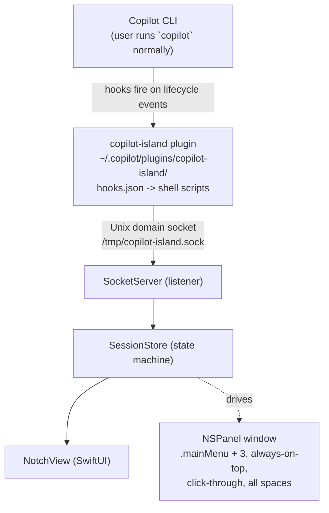
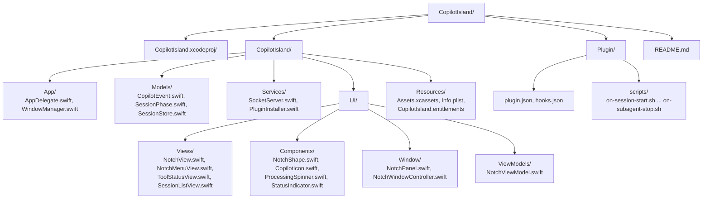
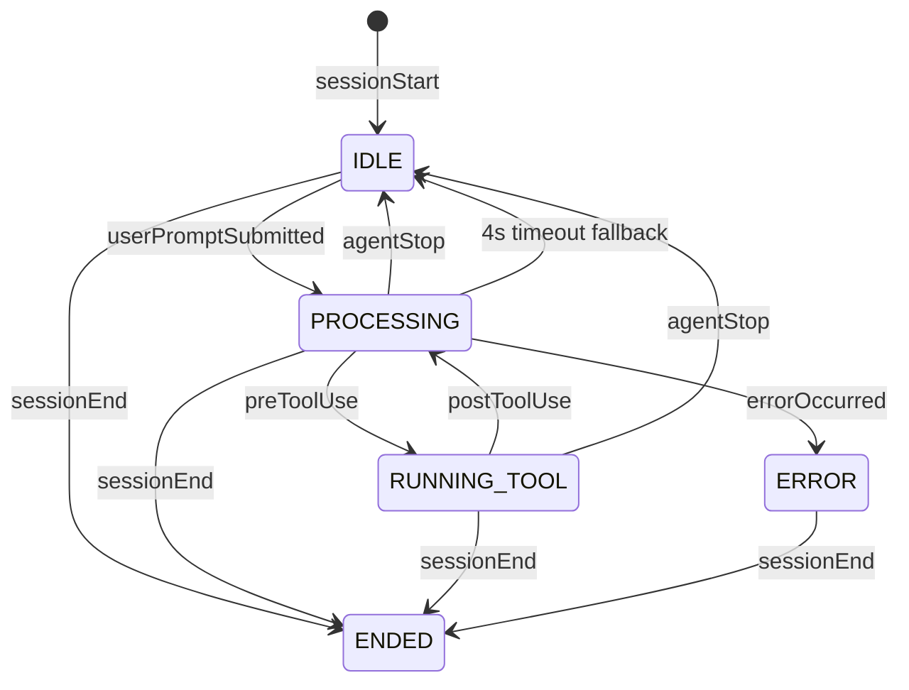

# Copilot Island — Implementation Plan

> A macOS Dynamic Island-style notch app for GitHub Copilot CLI, inspired by [Claude Island](https://github.com/farouqaldori/claude-island) (Apache 2.0 licensed).

## Table of Contents

- [Architecture Overview](#architecture-overview)
- [Phase 0: Project Setup](#phase-0-project-setup)
- [Phase 1: macOS Notch Window (Reuse from Claude Island)](#phase-1-macos-notch-window-reuse-from-claude-island)
- [Phase 2: Event Bridge (Copilot CLI → App)](#phase-2-event-bridge-copilot-cli--app)
- [Phase 3: Session State Machine](#phase-3-session-state-machine)
- [Phase 4: Copilot CLI Plugin (Distribution)](#phase-4-copilot-cli-plugin-distribution)
- [Phase 5: Rich Events via Copilot SDK (Optional)](#phase-5-rich-events-via-copilot-sdk-optional)
- [Known Limitations & Workarounds](#known-limitations--workarounds)
- [File-by-File Reuse Guide from Claude Island](#file-by-file-reuse-guide-from-claude-island)
- [Appendix: Event Mapping Tables](#appendix-event-mapping-tables)

---

## Architecture Overview



---

## Phase 0: Project Setup

### 0.1 Create Xcode Project



### 0.2 Dependencies (Swift Package Manager)

| Package | Purpose | Required? |
|---------|---------|-----------|
| — | No Sparkle (no auto-update for v1) | — |
| — | No Mixpanel (no analytics) | — |
| — | No swift-markdown (no chat rendering in v1) | — |

> Minimal dependencies for Phase 1. The app is intentionally lean.

### 0.3 Build Settings

- **Deployment target**: macOS 14.0+ (for modern SwiftUI features)
- **App Sandbox**: OFF (needs Unix socket access)
- **Hardened Runtime**: ON
- **App category**: Developer Tools
- **LSUIElement**: YES (menu bar app, no dock icon)

---

## Phase 1: macOS Notch Window (Reuse from Claude Island)

This phase is almost entirely copy-paste from Claude Island. The notch UI is Claude-agnostic — it's just a floating SwiftUI panel positioned at the physical notch.

### 1.1 Files to Copy UNCHANGED from Claude Island

These files contain no Claude-specific logic and can be used as-is:

| Claude Island File | Copy To | Why It's Reusable |
|---|---|---|
| `UI/Window/NotchPanel.swift` | `UI/Window/NotchPanel.swift` | NSPanel config: floating, above menu bar, click-through, all spaces. Zero Claude references |
| `UI/Components/NotchShape.swift` | `UI/Components/NotchShape.swift` | Custom SwiftUI Shape with Path for notch outline. Pure geometry — `topCornerRadius`, `bottomCornerRadius` |
| `UI/Components/ProcessingSpinner.swift` | `UI/Components/ProcessingSpinner.swift` | Animated spinner. Generic SwiftUI animation |
| `UI/Window/NotchWindowController.swift` | `UI/Window/NotchWindowController.swift` | NSWindowController that creates NotchPanel and hosts SwiftUI content |

### 1.2 Files to ADAPT from Claude Island

These need targeted modifications — replace Claude-specific references with Copilot equivalents:

| Claude Island File | Adapt To | What to Change |
|---|---|---|
| `App/WindowManager.swift` | `App/WindowManager.swift` | Replace `ClaudeSessionMonitor` with `CopilotSessionMonitor`. Replace `HookSocketServer` init with `SocketServer` init. Remove Sparkle/update code |
| `App/AppDelegate.swift` | `App/AppDelegate.swift` | Remove `HookInstaller.installIfNeeded()` → replace with `PluginInstaller.installIfNeeded()`. Remove Sparkle updater init. Remove Mixpanel init. Keep `WindowManager.setupNotchWindow()` call |
| `UI/Views/NotchView.swift` | `UI/Views/NotchView.swift` | This is the main file. Replace `ClaudeCrabIcon` → `CopilotIcon`. Replace `ClaudeSessionMonitor` → `CopilotSessionMonitor`. Remove `ChatView` content type (Phase 1 doesn't show chat). Keep all animation logic unchanged (spring animations, matchedGeometryEffect, expansion width) |
| `UI/Views/NotchMenuView.swift` | `UI/Views/NotchMenuView.swift` | Remove "Hooks" toggle (plugin handles this). Remove update row. Add "Plugin Status" indicator. Add "Quit" button |
| `UI/ViewModels/NotchViewModel.swift` | `UI/ViewModels/NotchViewModel.swift` | Keep `status` enum (`.closed`, `.popping`, `.opened`). Keep `contentType` enum but simplify to `.sessions` and `.menu`. Keep `deviceNotchRect`, `openedSize`. Remove Claude-specific content types |
| `Models/SessionEvent.swift` | `Models/SessionPhase.swift` | Keep the `SessionPhase` enum: `.idle`, `.processing`, `.waitingForApproval`, `.waitingForInput`, `.compacting`, `.ended`. Remove `.compacting` if not needed (Copilot hooks don't expose compaction) |
| `UI/Views/ClaudeInstancesView.swift` | `UI/Views/SessionListView.swift` | Rename references. Simplify to show: session CWD, current phase, tool being run |
| `UI/Components/PermissionIndicatorIcon.swift` | `UI/Components/StatusIndicator.swift` | Change color from Claude orange (0.85, 0.47, 0.34) to Copilot blue/purple. Keep the matchedGeometryEffect integration |

### 1.3 Files to Write NEW

| File | Purpose | Implementation Notes |
|---|---|---|
| `UI/Components/CopilotIcon.swift` | Copilot logo in notch | Option A: Use `Canvas` like ClaudeCrabIcon to draw the Copilot icon programmatically. Option B: Use an SF Symbol or bundled PNG via `ImageRun`. Keep it simple — a small circle with a stylized "CP" or the Copilot octicon |

### 1.4 Key UI Behaviors to Preserve

These are what make Claude Island feel polished. Preserve them exactly:

```swift
// From NotchView.swift — expansion animation
let openAnimation = Animation.spring(response: 0.3, dampingFraction: 0.8)
let closeAnimation = Animation.spring(response: 0.25, dampingFraction: 1.0)

// NotchPanel configuration (from NotchPanel.swift)
isFloatingPanel = true
level = .mainMenu + 3
collectionBehavior = [.fullScreenAuxiliary, .stationary, .canJoinAllSpaces, .ignoresCycle]
isMovable = false
backgroundColor = .clear
isOpaque = false
ignoresMouseEvents = true  // default, selective hit-testing in sendEvent(_:)

// Pill expansion (from NotchView.swift)
var expansionWidth: CGFloat {
    // Adds extra width when processing or showing status
    // Creates the dynamic island "pill" effect
}
```

---

## Phase 2: Event Bridge (Copilot CLI → App)

### 2.1 Unix Socket Server (adapt from Claude Island's HookSocketServer)

**Source**: `ClaudeIsland/System/HookSocketServer.swift`

**Adapt to**: `CopilotIsland/Services/SocketServer.swift`

```swift
// SocketServer.swift — adapted from HookSocketServer
import Foundation

actor SocketServer {
    static let socketPath = "/tmp/copilot-island.sock"

    private var serverSocket: Int32 = -1
    private var isRunning = false

    /// Start listening for events from hook scripts
    func start() async throws {
        // 1. Remove stale socket file if exists
        unlink(Self.socketPath)

        // 2. Create Unix domain socket (SOCK_STREAM)
        serverSocket = socket(AF_UNIX, SOCK_STREAM, 0)

        // 3. Bind to /tmp/copilot-island.sock
        var addr = sockaddr_un()
        addr.sun_family = sa_family_t(AF_UNIX)
        Self.socketPath.withCString { ptr in
            withUnsafeMutablePointer(to: &addr.sun_path.0) { dest in
                _ = strcpy(dest, ptr)
            }
        }

        // 4. Listen + accept loop
        // Each hook script connects, writes JSON, disconnects
        // Parse JSON → CopilotEvent → forward to SessionStore
    }

    /// Parse incoming JSON from hook scripts
    func parseEvent(json: Data) -> CopilotEvent? {
        // Hook scripts send:
        // {"event": "sessionStart", "timestamp": 1704614400000, "cwd": "/path", ...}
        let decoder = JSONDecoder()
        return try? decoder.decode(CopilotEvent.self, from: json)
    }
}
```

**Key differences from Claude Island's HookSocketServer:**
- Claude Island's server receives events in Claude Code's HookEvent format (with `event`, `status`, `toolName`, etc.)
- Copilot Island's server receives a simpler format (we control the format since we write the hook scripts)
- No JSONL file monitoring needed (Copilot session-state format is undocumented)

### 2.2 Event Model

**New file**: `CopilotIsland/Models/CopilotEvent.swift`

```swift
import Foundation

/// Events received from Copilot CLI hook scripts via Unix socket
struct CopilotEvent: Codable {
    let event: EventType
    let timestamp: Int64
    let cwd: String

    // Optional fields depending on event type
    let source: String?          // sessionStart: "new" | "resume" | "startup"
    let initialPrompt: String?   // sessionStart
    let reason: String?          // sessionEnd: "complete" | "error" | "abort" | "timeout" | "user_exit"
    let prompt: String?          // userPromptSubmitted
    let toolName: String?        // preToolUse, postToolUse
    let toolArgs: String?        // preToolUse, postToolUse (JSON string)
    let toolResult: ToolResult?  // postToolUse
    let errorMessage: String?    // errorOccurred

    enum EventType: String, Codable {
        case sessionStart
        case sessionEnd
        case userPromptSubmitted
        case preToolUse
        case postToolUse
        case errorOccurred
        case agentStop
        case subagentStop
    }

    struct ToolResult: Codable {
        let resultType: String?       // "text" | "error" | etc.
        let textResultForLlm: String? // truncated result
    }
}
```

### 2.3 Hook Scripts (what runs inside Copilot CLI)

Each hook script reads JSON from stdin (provided by Copilot CLI), wraps it with our event type, and sends it to the Unix socket.

**Template for all scripts** — `Plugin/scripts/_bridge.sh`:

```bash
#!/usr/bin/env bash
# _bridge.sh — shared logic for all hook scripts
# Usage: echo '{"toolName":"bash",...}' | EVENT_TYPE=preToolUse ./_bridge.sh

SOCKET="/tmp/copilot-island.sock"
INPUT=$(cat)
EVENT_TYPE="${EVENT_TYPE:-unknown}"

# Wrap the Copilot CLI hook input with our event type
PAYLOAD=$(echo "$INPUT" | jq -c --arg evt "$EVENT_TYPE" '. + {event: $evt}')

# Send to Unix socket (netcat or socat)
# Using Python as a portable fallback if socat isn't available
if command -v socat &>/dev/null; then
    echo "$PAYLOAD" | socat - UNIX-CONNECT:"$SOCKET" 2>/dev/null
elif command -v python3 &>/dev/null; then
    python3 -c "
import socket, sys
s = socket.socket(socket.AF_UNIX, socket.SOCK_STREAM)
try:
    s.connect('$SOCKET')
    s.sendall(sys.stdin.buffer.read())
finally:
    s.close()
" <<< "$PAYLOAD" 2>/dev/null
fi

# Always exit 0 so we never block Copilot CLI
exit 0
```

**Individual hook scripts** (one-liners that call the bridge):

```bash
# Plugin/scripts/on-session-start.sh
#!/usr/bin/env bash
EVENT_TYPE=sessionStart exec "$(dirname "$0")/_bridge.sh"

# Plugin/scripts/on-session-end.sh
#!/usr/bin/env bash
EVENT_TYPE=sessionEnd exec "$(dirname "$0")/_bridge.sh"

# Plugin/scripts/on-prompt.sh
#!/usr/bin/env bash
EVENT_TYPE=userPromptSubmitted exec "$(dirname "$0")/_bridge.sh"

# Plugin/scripts/on-pre-tool.sh
#!/usr/bin/env bash
EVENT_TYPE=preToolUse exec "$(dirname "$0")/_bridge.sh"

# Plugin/scripts/on-post-tool.sh
#!/usr/bin/env bash
EVENT_TYPE=postToolUse exec "$(dirname "$0")/_bridge.sh"

# Plugin/scripts/on-error.sh
#!/usr/bin/env bash
EVENT_TYPE=errorOccurred exec "$(dirname "$0")/_bridge.sh"

# Plugin/scripts/on-agent-stop.sh
#!/usr/bin/env bash
EVENT_TYPE=agentStop exec "$(dirname "$0")/_bridge.sh"

# Plugin/scripts/on-subagent-stop.sh
#!/usr/bin/env bash
EVENT_TYPE=subagentStop exec "$(dirname "$0")/_bridge.sh"
```

---

## Phase 3: Session State Machine

### 3.1 SessionStore (adapt from Claude Island)

**Source**: `ClaudeIsland/Session/SessionStore.swift`

**Adapt to**: `CopilotIsland/Models/SessionStore.swift`

Claude Island's SessionStore is a Swift actor with a `process(_:)` method. We simplify it because:
- No JSONL parsing (we don't have access to Copilot's session files)
- No PermissionRequest phase (Copilot hooks can only deny, not ask)
- No compaction phase (no hook for it)
- Add timeout-based idle detection (Copilot has no `Notification` event)

```swift
import Foundation
import Combine

enum SessionPhase: Equatable {
    case idle
    case processing
    case runningTool(name: String)
    case error(message: String)
    case ended(reason: String)
}

@MainActor
class SessionStore: ObservableObject {
    @Published var phase: SessionPhase = .idle
    @Published var currentToolName: String?
    @Published var sessionActive: Bool = false
    @Published var lastPrompt: String?
    @Published var cwd: String?

    private var idleTimer: Timer?
    private let idleTimeoutSeconds: TimeInterval = 4.0

    func process(_ event: CopilotEvent) {
        switch event.event {

        case .sessionStart:
            sessionActive = true
            cwd = event.cwd
            phase = .idle
            // If there's an initial prompt, go to processing
            if event.initialPrompt != nil {
                phase = .processing
                resetIdleTimer()
            }

        case .userPromptSubmitted:
            lastPrompt = event.prompt
            phase = .processing
            resetIdleTimer()

        case .preToolUse:
            currentToolName = event.toolName
            phase = .runningTool(name: event.toolName ?? "tool")
            resetIdleTimer()

        case .postToolUse:
            currentToolName = nil
            phase = .processing  // more tools may follow
            resetIdleTimer()

        case .errorOccurred:
            phase = .error(message: event.errorMessage ?? "Unknown error")
            resetIdleTimer()

        case .agentStop:
            // This is the closest to Claude Code's "Stop" event
            // Agent finished its turn — now waiting for user input
            phase = .idle
            cancelIdleTimer()

        case .subagentStop:
            // Subagent finished, parent may continue
            phase = .processing
            resetIdleTimer()

        case .sessionEnd:
            sessionActive = false
            phase = .ended(reason: event.reason ?? "complete")
            cancelIdleTimer()
        }
    }

    // MARK: - Idle Detection (workaround for missing Notification hook)

    /// After the last event, if nothing happens for N seconds, assume idle
    private func resetIdleTimer() {
        idleTimer?.invalidate()
        idleTimer = Timer.scheduledTimer(withTimeInterval: idleTimeoutSeconds, repeats: false) { [weak self] _ in
            Task { @MainActor in
                guard let self = self else { return }
                // Only transition to idle if we're in a transient state
                if case .processing = self.phase { self.phase = .idle }
                if case .runningTool = self.phase { self.phase = .idle }
            }
        }
    }

    private func cancelIdleTimer() {
        idleTimer?.invalidate()
        idleTimer = nil
    }
}
```

### 3.2 State Transition Diagram



---

## Phase 4: Copilot CLI Plugin (Distribution)

### 4.1 Plugin Manifest

**File**: `Plugin/plugin.json`

```json
{
  "name": "copilot-island",
  "description": "Dynamic Island-style session monitor for GitHub Copilot CLI on macOS",
  "version": "0.1.0",
  "author": {
    "name": "Daniel"
  },
  "license": "MIT",
  "keywords": ["monitor", "notch", "dynamic-island", "macos", "session"],
  "hooks": "hooks.json"
}
```

### 4.2 Hooks Configuration

**File**: `Plugin/hooks.json`

```json
{
  "version": 1,
  "hooks": {
    "sessionStart": [
      {
        "type": "command",
        "bash": "./scripts/on-session-start.sh",
        "timeoutSec": 5
      }
    ],
    "sessionEnd": [
      {
        "type": "command",
        "bash": "./scripts/on-session-end.sh",
        "timeoutSec": 5
      }
    ],
    "userPromptSubmitted": [
      {
        "type": "command",
        "bash": "./scripts/on-prompt.sh",
        "timeoutSec": 5
      }
    ],
    "preToolUse": [
      {
        "type": "command",
        "bash": "./scripts/on-pre-tool.sh",
        "timeoutSec": 5
      }
    ],
    "postToolUse": [
      {
        "type": "command",
        "bash": "./scripts/on-post-tool.sh",
        "timeoutSec": 5
      }
    ],
    "errorOccurred": [
      {
        "type": "command",
        "bash": "./scripts/on-error.sh",
        "timeoutSec": 5
      }
    ],
    "agentStop": [
      {
        "type": "command",
        "bash": "./scripts/on-agent-stop.sh",
        "timeoutSec": 5
      }
    ],
    "subagentStop": [
      {
        "type": "command",
        "bash": "./scripts/on-subagent-stop.sh",
        "timeoutSec": 5
      }
    ]
  }
}
```

### 4.3 Plugin Installer (Auto-Install from App)

**New file**: `CopilotIsland/Services/PluginInstaller.swift`

```swift
import Foundation

struct PluginInstaller {
    static let pluginDir = FileManager.default.homeDirectoryForCurrentUser
        .appendingPathComponent(".copilot/plugins/copilot-island")

    /// Copies bundled plugin files to ~/.copilot/plugins/copilot-island/
    static func installIfNeeded() {
        let fm = FileManager.default

        // Check if plugin is already installed and up-to-date
        let manifestPath = pluginDir.appendingPathComponent("plugin.json")
        if fm.fileExists(atPath: manifestPath.path) {
            // TODO: Version check — compare installed vs bundled version
            return
        }

        // Create plugin directory
        try? fm.createDirectory(at: pluginDir, withIntermediateDirectories: true)

        // Copy from app bundle
        guard let bundledPlugin = Bundle.main.url(forResource: "Plugin", withExtension: nil) else {
            print("⚠️ Plugin bundle not found")
            return
        }

        // Copy all files recursively
        let items = (try? fm.contentsOfDirectory(at: bundledPlugin, includingPropertiesForKeys: nil)) ?? []
        for item in items {
            let dest = pluginDir.appendingPathComponent(item.lastPathComponent)
            try? fm.copyItem(at: item, to: dest)
        }

        // Make scripts executable
        let scriptsDir = pluginDir.appendingPathComponent("scripts")
        if let scripts = try? fm.contentsOfDirectory(at: scriptsDir, includingPropertiesForKeys: nil) {
            for script in scripts where script.pathExtension == "sh" {
                try? fm.setAttributes([.posixPermissions: 0o755], ofItemAtPath: script.path)
            }
        }

        print("✅ Copilot Island plugin installed to \(pluginDir.path)")
    }

    static func uninstall() {
        try? FileManager.default.removeItem(at: pluginDir)
    }

    static var isInstalled: Bool {
        FileManager.default.fileExists(atPath: pluginDir.appendingPathComponent("plugin.json").path)
    }
}
```

### 4.4 User Flow

1. User downloads and opens **Copilot Island.app**
2. On first launch, `PluginInstaller.installIfNeeded()` copies plugin to `~/.copilot/plugins/copilot-island/`
3. User runs `copilot` normally in their terminal
4. Hooks fire → scripts send events to Unix socket → notch UI updates
5. **No manual setup, no headless mode, no flags, no `/plugin install` needed**

> **Alternative**: If you prefer the user to install via CLI:
> ```bash
> copilot /plugin install ~/.copilot/plugins/copilot-island
> ```
> This is cleaner but requires user action. Auto-install from the app is more like Claude Island's approach.

---

## Phase 5: Rich Events via Copilot SDK (Optional Enhancement)

The hooks system covers ~80% of Claude Island's features. For the remaining 20%, the **Copilot SDK** provides a much richer event stream:

### Events Available in SDK but NOT in Hooks

| SDK Event | What It Gives You | Claude Island Equivalent |
|---|---|---|
| `session.idle` | Agent finished, waiting for input | `Notification(idle_prompt)` ✅ |
| `session.compaction_start` / `session.compaction_complete` | Context window being compressed | `PreCompact` ✅ |
| `assistant.turn_start` / `assistant.turn_end` | Response generation boundaries | `Stop` ✅ |
| `assistant.message_delta` | Streaming response text | JSONL parsing ✅ |
| `assistant.reasoning_delta` | Streaming reasoning/thinking | JSONL thinking blocks ✅ |
| `tool.execution_start` / `tool.execution_complete` | Typed tool lifecycle | `PreToolUse`/`PostToolUse` ✅ |
| `subagent.started` / `subagent.completed` / `subagent.failed` | Full subagent lifecycle | `SubagentStart`/`SubagentStop` ✅ |
| `session.error` | Error details | `PostToolUseFailure` ✅ |
| `hook.start` / `hook.end` | Hook execution tracking | N/A |

### SDK Integration Architecture (Phase 5)

```
Option A: Headless mode (the app manages copilot-cli)
  App starts: copilot --headless --port 4321
  SDK connects to localhost:4321
  Gets full event stream
  Downside: user loses interactive terminal

Option B: Hybrid (hooks + SDK companion)
  User runs copilot normally → hooks for basic events
  App also watches ~/.copilot/session-state/ for richer data
  Downside: session-state format undocumented

Option C: Future — when Copilot CLI adds more hooks
  GitHub Issue #1157 requests: Stop, Notification, global hooks
  If these land, hooks alone cover 95%+ of features
```

**Recommendation**: Start with hooks only (Phases 1-4). Add SDK integration later if/when you need streaming response text or compaction tracking.

---

## Known Limitations & Workarounds

### 1. No `Notification`/`idle_prompt` Event

**Problem**: Can't detect "Copilot is done and waiting for input" — the single most important signal for the UI.

**Workaround**: Use `agentStop` hook (fires when agent completes its turn). If `agentStop` is unavailable or unreliable, fall back to timeout (4 seconds after last `postToolUse` with no subsequent `preToolUse`).

### 2. No `Stop` Event

**Problem**: Can't detect when the response generation finishes.

**Workaround**: `agentStop` covers this. It fires when the agent's turn is complete.

### 3. Hooks Don't Fire on Resumed Sessions

**Known Bug**: [github/copilot-cli#1084](https://github.com/github/copilot-cli/issues/1084) — `sessionStart` and `sessionEnd` don't fire when using `copilot --continue` or `copilot --resume <sessionId>`.

**Workaround**: Monitor for `userPromptSubmitted` as a fallback session-start signal. If we receive any event but haven't seen `sessionStart`, treat it as a session start.

### 4. No Global Hooks (Per-Repo Only)

**Problem**: Hooks in `.github/hooks/` are per-repository. User needs to set up each repo.

**Workaround**: The **plugin approach** solves this. Plugin hooks are loaded globally across all projects. This is the primary reason we chose the plugin approach over repo-level hooks.

### 5. No `toolUseId` for Correlation

**Problem**: Can't correlate a specific `preToolUse` with its corresponding `postToolUse`.

**Workaround**: Use timestamp proximity and `toolName` matching. In practice, tools execute sequentially so the most recent `preToolUse` toolName matches the next `postToolUse`.

### 6. No `status` Field on Events

**Problem**: Claude Island reads `event.status` (running_tool, processing, waiting_for_input, etc.) to determine phase. Copilot hooks don't expose this.

**Workaround**: Infer status from event sequence (which is what the state machine in Phase 3 does).

---

## File-by-File Reuse Guide from Claude Island

| Claude Island File | Action | Effort | Notes |
|---|---|---|---|
| **UI/Window/NotchPanel.swift** | Copy unchanged | 0 effort | NSPanel config. Zero Claude refs |
| **UI/Components/NotchShape.swift** | Copy unchanged | 0 effort | Custom Shape path. Pure geometry |
| **UI/Components/ProcessingSpinner.swift** | Copy unchanged | 0 effort | Generic animation |
| **UI/Window/NotchWindowController.swift** | Copy unchanged | 0 effort | Standard NSWindowController |
| **App/WindowManager.swift** | Adapt | Low effort | Replace monitor class names, remove Sparkle |
| **UI/Views/NotchView.swift** | Adapt | Medium effort | Core file. Replace icon, remove ChatView, rewire observed objects. **Keep all animation code** |
| **UI/ViewModels/NotchViewModel.swift** | Adapt | Low effort | Simplify contentType enum |
| **UI/Views/NotchMenuView.swift** | Adapt | Low effort | Remove Claude-specific toggles, add plugin status |
| **App/AppDelegate.swift** | Adapt | Low effort | Replace HookInstaller → PluginInstaller, remove analytics |
| **Models/SessionEvent.swift** | Rewrite | Medium effort | New `CopilotEvent` + `SessionPhase` types |
| **Session/SessionStore.swift** | Rewrite | Medium effort | New state machine with idle timeout |
| **System/HookSocketServer.swift** | Adapt | Medium effort | Same socket pattern, different JSON format |
| **Session/ConversationParser.swift** | Skip | N/A | No equivalent for Copilot (session-state format unknown) |
| **UI/Components/ClaudeCrabIcon.swift** | Replace | Low effort | New CopilotIcon using Canvas or SF Symbol |
| **UI/Views/ChatView.swift** | Skip (Phase 1) | N/A | Optional Phase 5 feature |
| **Services/Update/NotchUserDriver.swift** | Skip | N/A | No auto-update in v1 |

### Reuse Summary

| Category | Files | Effort |
|---|---|---|
| Copy unchanged | 4 files | Zero |
| Light adaptation | 5 files | ~2 hours |
| Medium rewrite | 3 files | ~4 hours |
| Write new | 4 files (CopilotEvent, SocketServer, PluginInstaller, CopilotIcon) | ~3 hours |
| Skip | 3 files | — |
| **Total estimated** | **16 files** | **~9 hours for a working prototype** |

---

## Appendix: Event Mapping Tables

### Claude Code Hooks → Copilot CLI Hooks

| Claude Code Hook | Copilot CLI Hook | Match Quality |
|---|---|---|
| `SessionStart` | `sessionStart` | ✅ Identical purpose |
| `SessionEnd` | `sessionEnd` | ✅ Copilot gives richer `reason` field |
| `UserPromptSubmit` | `userPromptSubmitted` | ✅ Identical purpose |
| `PreToolUse` | `preToolUse` | ✅ Both provide toolName + toolArgs |
| `PostToolUse` | `postToolUse` | ✅ Copilot also gives toolResult |
| `PostToolUseFailure` | `errorOccurred` | ⚠️ Different scope but covers errors |
| `PermissionRequest` | — | ❌ No equivalent. `preToolUse` can deny but can't signal "waiting for approval" |
| `Stop` | `agentStop` | ⚠️ Similar — agent finished its turn |
| `Notification` (idle_prompt) | — | ❌ Key gap. Use `agentStop` + timeout |
| `PreCompact` | — | ❌ No hook. SDK has `session.compaction_start` |
| `SubagentStart` | — | ❌ No hook. Could infer from preToolUse on delegation tool |
| `SubagentStop` | `subagentStop` | ✅ Direct match |
| `ConfigChange` | — | ❌ No equivalent needed |

### What Claude Island Uses → What Copilot Island Can Use

| Claude Island Feature | How Claude Island Does It | How Copilot Island Does It |
|---|---|---|
| Show notch on session start | `SessionStart` hook → `.idle` phase | `sessionStart` hook → show notch |
| Show "Processing" | `UserPromptSubmit` + status field | `userPromptSubmitted` → `.processing` |
| Show tool being run | `PreToolUse` hook → tool name | `preToolUse` hook → tool name |
| Show tool complete | `PostToolUse` hook → update UI | `postToolUse` hook → back to `.processing` |
| Show "Waiting for input" | `Notification(idle_prompt)` → `.idle` | `agentStop` → `.idle` (+ timeout fallback) |
| Show permission dialog | `PermissionRequest` → approve/deny buttons | ❌ Not possible — preToolUse can only block silently |
| Show compacting | `PreCompact` → `.compacting` | ❌ Not shown (cosmetic — not critical) |
| Collapse on session end | `SessionEnd` → `.ended` → hide | `sessionEnd` → `.ended(reason)` → hide |
| Rich conversation view | JSONL file parsing | ❌ Phase 1 skips this. Phase 5 via SDK |

### Copilot SDK Events (Phase 5 Reference)

| SDK Event | Type | Available in Hooks? |
|---|---|---|
| `session.start` | Lifecycle | ✅ `sessionStart` |
| `session.idle` | Lifecycle | ❌ use `agentStop` |
| `session.resume` | Lifecycle | ❌ (bug: hooks don't fire on resume) |
| `session.shutdown` | Lifecycle | ✅ `sessionEnd` |
| `session.error` | Error | ✅ `errorOccurred` |
| `session.compaction_start` | Context | ❌ |
| `session.compaction_complete` | Context | ❌ |
| `session.model_change` | Config | ❌ |
| `assistant.turn_start` | Response | ❌ |
| `assistant.turn_end` | Response | ❌ (use `agentStop`) |
| `assistant.message_delta` | Streaming | ❌ |
| `assistant.reasoning_delta` | Streaming | ❌ |
| `tool.execution_start` | Tool | ✅ `preToolUse` |
| `tool.execution_complete` | Tool | ✅ `postToolUse` |
| `subagent.started` | Subagent | ❌ |
| `subagent.completed` | Subagent | ✅ `subagentStop` |
| `subagent.failed` | Subagent | ❌ |
| `hook.start` / `hook.end` | Meta | ❌ |

---

## Implementation Order (give this to the coding agent)

```
Step 1: Copy the 4 unchanged files from Claude Island
        → NotchPanel.swift, NotchShape.swift, ProcessingSpinner.swift, NotchWindowController.swift

Step 2: Create CopilotEvent.swift and SessionPhase enum (the data models)

Step 3: Create SessionStore.swift with the state machine and idle timeout

Step 4: Adapt SocketServer.swift from HookSocketServer.swift

Step 5: Adapt AppDelegate.swift and WindowManager.swift
        → Wire SocketServer → SessionStore → NotchViewModel

Step 6: Adapt NotchView.swift (the main UI)
        → Replace ClaudeCrabIcon with CopilotIcon
        → Wire to new SessionStore
        → Keep all animation code

Step 7: Create CopilotIcon.swift (simple Canvas-drawn icon)

Step 8: Create the plugin files (plugin.json, hooks.json, shell scripts)

Step 9: Create PluginInstaller.swift

Step 10: Adapt NotchMenuView.swift (add plugin status, quit button)

Step 11: Test end-to-end:
         1. Build and run the app
         2. Copy plugin to ~/.copilot/plugins/copilot-island/
         3. Run `copilot` in a project
         4. Verify notch appears and updates with tool usage
```
